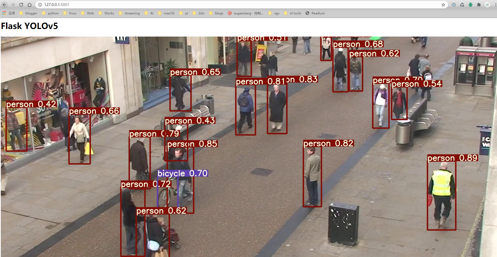

## yolov5-flask

使用 [yolov5](https://github.com/ultralytics/yolov5) 的 **v4.0** 版本

## 环境

```
pip install -r requirements.txt
```

## 运行

```
python app.py
```

`flask`服务启动后，浏览器中输入 <http://127.0.0.1:5001>


